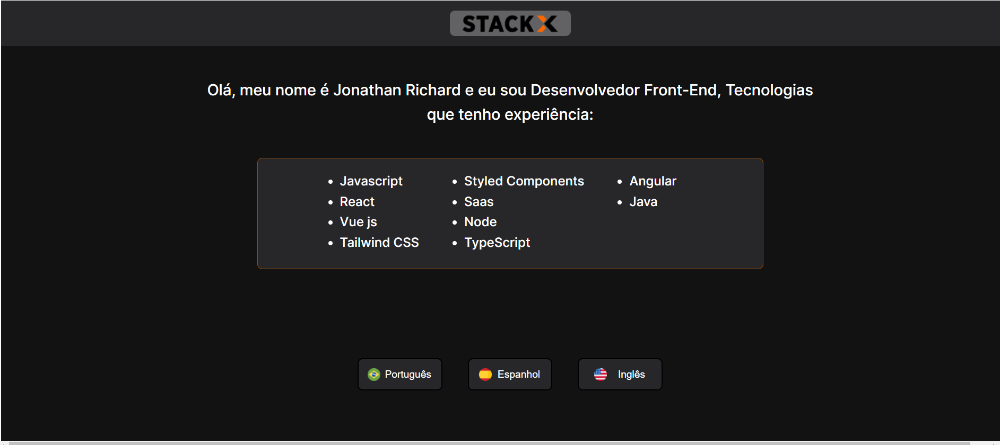

# web30-stackx-vue

# Desafio Web 3.0 StackX - VueJs

 

Projeto final do módulo WEB3.0 curso da StackX.

 

 


## Objetivos

 

- Construir um interface gráfica e funcional para interação com o usuário.
- Utilizar os conceitos de componetização do framework.
- Emitir eventos associados ao componente do botão possibilitando a troca de idiomas no conteúdo do título da página

 

 

 

## Stacks Utilizadas

 

**Front-end:**  Vue, Tailwind Css

 

 

## Screenshot




## Configurando o projeto
```
npm install
```

### Compilar e hot-reloads para ambiente de desenvolvimento
```
npm run serve
```

### Compilar e compactar para produção
```
npm run build
```

### Lints
```
npm run lint
```

### Customizar a configuração
See [Configuration Reference](https://cli.vuejs.org/config/).
